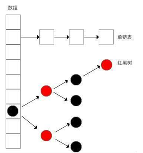

本文主要针对1.7与1.8两个版本探究HashMap的实现  


## 数据结构   
- HashMap在1.7上数据结构主要是`数组`+`链表`，数组与链表的实现类都是entry
- HashMap在1.8上数据结构主要是`数组`+`链表`+`红黑树`,链表的长度大于8且数组长度大于64时，后面的数据结构转化为红黑树，数组和链表节点实现类是node类  


## Hash值的计算上  
扰动函数的目的是减少Hash碰撞  
- HashMap1.7用了多次扰动处理(4次位运算+5次异或运算)  
- HashMap1.8用了1次位运算+1次异或运算  
  
  *为什么扩容的时候一定是2的n次幂？   

## 链表数据插入方法  
### HashMap1.7  
使用头插法  
扩容后位置与原链表位置相反，如果有多个线程在临界扩容点插入数据，极易发生死循环。 resize操作分为两步：
1. 扩容：长度为原来的两倍，条件：HashMao.Size>=Capacity * LoadFactor
2. rehash：将原Entry重新hash到新数组中，因为长度变了hash规则也发生了变化。
hash公式： index = HashCode(Key) & (Length - 1);
当原数组长度为8时，Hash运算是和111B(二进制的7)做与运算；新数组长度为16，Hash运算是和1111B(代表二进制的15)做与运算，`Hash结果很显然不同`     

    当HashMap到达Resize的临界点，此时线程A/B同时对HashMap做Put操作时同时到达reHash的步骤。线程A刚获取到一个entry e与e.next时，就被挂起，开始执行B线程， B线程顺利的执行完rehash过程，这时A持有的e与e.next顺序可能就反了，经过多次循环后e.next与e就会相互指向，形成链表环。总结如下：`链表头插法会颠倒原来链表的顺序。在并发的时候原来的顺序被另一个线程a颠倒了，而被挂起线程b恢复后拿扩容前的节点顺序继续完成第一次循环后，又遵循a线程扩容后的链表顺序重新排序链表中对的顺序，最终成环。`

### HashMap1.8  
使用尾插法，其中的红黑树扩容后与位置与原链表相同，可以避免出现逆序且链表死循环的问题  

## 扰动函数  
```java
static final int hash(Object key) {
    int h;
    return (key == null) ? 0 : (h = key.hashCode()) ^ (h >>> 16);
}
```
1.7中比1.8复杂，所以以1.8的hash方法为例，理论上散列值是一个int型，范围在-2147483648到2147483648，前后加起来有40亿，如果hash函数映射的比较均匀松散，一般很难出现碰撞。
```java
    static int indexFor(int h, int length) {
        return h & (length-1);
    }
```
HashMap中数组长度是2的整次幂，正好相当于一个低位掩码，hash()与indexFor()方法联合如图：

以上可知，hashCode之后，将自己的高16为与低16为做异或运算，增加低位的随机性,最后与数组长度做与运算，这时“干扰函数”的价值就体现出来了。

## 常见问题  

### 引入红黑树的原因   
提高HashMap性能：解决Hash碰撞后，链表过长导致的索引效率慢的问题(时间复杂度为o(N)),利用红黑树快速增删改查的特点，从而将时间复杂度从o(N)降到o(logn);   


### 为什么用红黑树不使用平衡二叉树   
红黑树的平衡度低于平衡二叉树，对于删除、插入后重新构造树的开销要比平衡二叉树低，查询效率要比普通二叉树。平衡二叉树为了维持平衡所付出的代价比从中获取利益的代价大。当然对于插入删除操作不频繁，只对查找要求高的场景，平衡二叉树还是优于红黑树的   


### 为什么不直接使用红黑树  
红黑树是为了解决`当链表过长时`索引慢的问题的，红黑树需要左旋、右旋操作，而单链表不需要，并且单拉链表的方式实现起来比较简单   


### 为什么是大于8个的时候才转换红黑树  
当桶的元素超过8个`并且`散列表容量超过64个的时候结构才会变成红黑树  
当个数不多的时候，链表查询效率反而会更高，当元素大于8个，红黑树的查询成本低与链表 


### 为什么红黑树转链表值为6，链表转红黑树值为8  
中间有个差值可以防止链表与树频繁转换。假设转换界点都为8，则一个HashMap不停的插入、删除元素，元素个数徘徊在8左右，则会频繁地发生链表与树的转化，效率很低    


### 为什么HashMap查找元素的时间复杂度我们认为是O(1)  
一般我们会指定初始化时HashMap容量，避免hash碰撞，如果没有碰撞，就不会出现链表与红黑树，那么就是O(1)  

